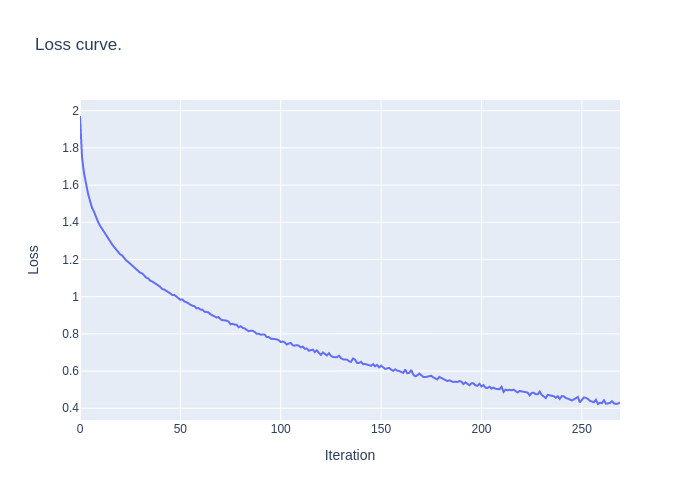

# visual-analytics-assignmen2
Second Assignment for Visual Analytics in Cultural Data Science.
This assignment is oriented at using logistic regression and multi-layer perceptrons for image classification.

Classifiers were trained on the CIFAR10 dataset with all images greyscaled.

## Usage

Install dependencies:

```bash
pip install -r requirements.txt
```

Run logistic regression classifier:

```bash
python3 src/logistic_regression.py
```

Run Neural Network:

```bash
python3 src/neural_network.py
```

Both scripts will save classification reports to the `out/` folder, along with a loss curve for the neural network classifier.

```
 - out/
    - logistic_regression_report.txt
    - neural_network_report.txt
    - neural_network_loss_curve.txt
```

## Results

Both classifiers performed well above chance level (10% accuracy) on the unseen data.
The neural network performed notably better on all classes.
This is likely due to the fact that the feature space (pixel brightness values) is very rich and also very collinear.
A neural network with at least one hidden layer is better able to capture interactions between individual pixels than a shallow logistic regression model.

Neither models yielded satisfactory performance for production usage, and more iterations would be needed to arrive at a reliable solution.

Hyperparameter tuning with grid search or Bayesian optimization might provide marginally better results, but would significantly increase computational load.
Results could likely be significantly improved by finetuning pretrained vision models or simply by using a convolutional network instead of a fully connected one,
as CNNs are more parameter-efficient and are better able to represent spatial characteristics of images.
 
### Logistic Regression

| Class                         | Precision | Recall | F1-score | Support |
|-------------------------------|-----------|--------|----------|---------|
| aquatic                       | 0.31      | 0.31   | 0.31     | 1000    |
| fish                          | 0.33      | 0.36   | 0.34     | 1000    |
| flowers                       | 0.22      | 0.19   | 0.20     | 1000    |
| food_containers_bottle        | 0.19      | 0.15   | 0.17     | 1000    |
| fruit_and_vegetables          | 0.22      | 0.18   | 0.20     | 1000    |
| household_electrical_devices  | 0.28      | 0.29   | 0.28     | 1000    |
| household_furniture           | 0.25      | 0.26   | 0.25     | 1000    |
| insects                       | 0.26      | 0.27   | 0.26     | 1000    |
| large_carnivores              | 0.32      | 0.39   | 0.35     | 1000    |
| large_man_made_outdoor_things | 0.36      | 0.42   | 0.38     | 1000    |
| **Accuracy**                  |           |        | **0.28**| **10000**|
| **Macro avg**                 | 0.27      | 0.28   | 0.28     | 10000   |
| **Weighted avg**              | 0.27      | 0.28   | 0.28     | 10000   |

### Multilayer Perceptron

| Class                         | Precision | Recall | F1-score | Support |
|-------------------------------|-----------|--------|----------|---------|
| aquatic                       | 0.40      | 0.45   | 0.42     | 1000    |
| fish                          | 0.44      | 0.45   | 0.45     | 1000    |
| flowers                       | 0.30      | 0.30   | 0.30     | 1000    |
| food_containers_bottle        | 0.21      | 0.22   | 0.22     | 1000    |
| fruit_and_vegetables          | 0.28      | 0.27   | 0.28     | 1000    |
| household_electrical_devices  | 0.35      | 0.33   | 0.34     | 1000    |
| household_furniture           | 0.38      | 0.36   | 0.37     | 1000    |
| insects                       | 0.42      | 0.44   | 0.43     | 1000    |
| large_carnivores              | 0.53      | 0.47   | 0.50     | 1000    |
| large_man_made_outdoor_things | 0.41      | 0.40   | 0.41     | 1000    |
| **Accuracy**                  |           |        | **0.37**| **10000**|
| **Macro avg**                 | 0.37      | 0.37   | 0.37     | 10000   |
| **Weighted avg**              | 0.37      | 0.37   | 0.37     | 10000   |



As we can see from the loss curve, loss was still decreasing on the training set when training was terminated.
This indicates that the optimizer might not have converged at an optimal solution yet, and increasing the maximum number of iterations could result in better performance.
